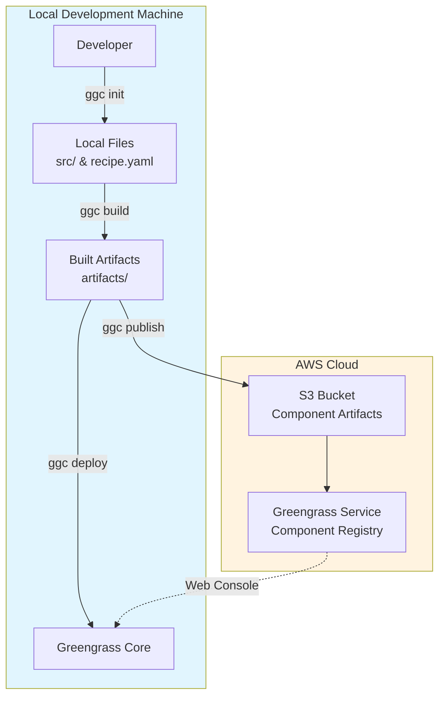

# GGC

A command-line tool to streamline AWS IoT Greengrass component development

## Prerequisites

- [AWS CLI](https://docs.aws.amazon.com/cli/latest/userguide/getting-started-install.html) - Required for build and publish commands
- [Greengrass CLI](https://docs.aws.amazon.com/greengrass/v2/developerguide/gg-cli-reference.html) - Required for deploy command only

## Commands

```
ggc - AWS IoT Greengrass Component Development Commands

Usage:
  ggc COMMAND
  ggc [COMMAND] --help | -h
  ggc --version | -v

Commands:
  init       Initialize a new component
  build      Build the component and prepare its artifacts
  publish    Upload the component artifacts and create component
  versions   Display the latest component versions
  deploy     Deploy the component locally
```

## Installation

```bash
# Create ~/.local/bin directory if it doesn't exist
mkdir -p ~/.local/bin

# Download ggc script
curl -o ~/.local/bin/ggc https://raw.githubusercontent.com/narutaro/ggc/main/ggc
chmod +x ~/.local/bin/ggc

# Download auto-completion file
curl -o ~/.local/bin/ggc-completions.bash https://raw.githubusercontent.com/narutaro/ggc/main/completions.bash

# Add to PATH (add to ~/.bashrc or ~/.zshrc)
export PATH="$PATH:$HOME/.local/bin"
```

### Enable auto-completion (optional)

**For Bash:**
```bash
echo "source ~/.local/bin/ggc-completions.bash" >> ~/.bashrc
```

**For Zsh:**
```bash
# Install bash-completion first
brew install bash-completion  # for macOS
# apt install bash-completion   # for Ubuntu

# Add to ~/.zshrc
echo "autoload -Uz bashcompinit && bashcompinit" >> ~/.zshrc
echo "source ~/.local/bin/ggc-completions.bash" >> ~/.zshrc
```

## Usage

### Initialize a component

```bash
ggc init <component_name> [language]
```

**Examples:**
```bash
ggc init my_component
# or specify language
ggc init my_component python
```

Generated structure:
```
my_component/
├── artifacts/
│   └── my_component/
├── config.yaml
├── recipes/
├── recipe.yaml          # ← edit
└── src/                 # ← edit
    └── my_component.py
```

Developers only need to edit files in `src/` and `recipe.yaml`.

### Other commands

```bash
# Build
ggc build <version>

# Publish
ggc publish [version]

# Deploy
ggc deploy [version]

# Check versions
ggc versions [component_name]
```

## Supported Languages

- Python (default)
- Ruby
- JavaScript
- Shell

## Environment Variables

- `MESSAGE_LEVEL`: Log level (DEBUG, INFO, WARN, ERROR)

## Development

### Build

```bash
# Generate command with bashly
bashly generate

# Update auto-completion file (when adding/removing subcommands)
bashly add completions_script
```

### Project Structure

```
src/
├── bashly.yml          # Command definition
├── *_command.sh        # Command implementations
└── lib/                # Shared libraries
    ├── aws_info.sh
    ├── colors.sh
    ├── filters.sh
    ├── log.sh
    ├── render.sh
    ├── templates.sh
    ├── validation.sh
    └── yaml.sh
```

## Architecture

