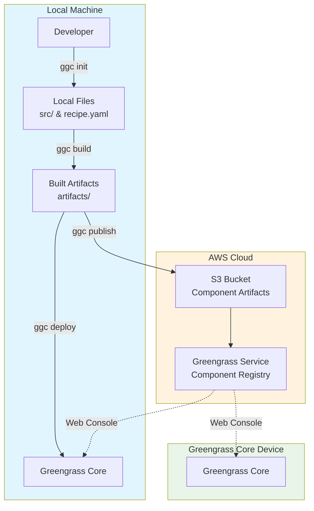

# GGC

A command-line tool to streamline AWS IoT Greengrass component development. If you find the official GDK (Greengrass Development Kit) cumbersome with its many configuration files and complex setup, GGC offers a simpler, more intuitive alternative.

## Prerequisites

- [AWS CLI](https://docs.aws.amazon.com/cli/latest/userguide/getting-started-install.html) - Required for build and publish commands
- [Greengrass CLI](https://docs.aws.amazon.com/greengrass/v2/developerguide/gg-cli-reference.html) - Required for deploy command only

## Commands

```
ggc - AWS IoT Greengrass Component Development Commands

Usage:
  ggc COMMAND
  ggc [COMMAND] --help | -h
  ggc --version | -v

Commands:
  init       Initialize a new component
  build      Build the component and prepare its artifacts
  publish    Upload the component artifacts and create component
  versions   Display the latest component versions
  deploy     Deploy the component locally
```

**Debug mode:** Set `export MESSAGE_LEVEL=DEBUG` to enable detailed logging output. Other available levels: `INFO`, `WARN`, `ERROR`.

## Installation

```bash
# Create ~/.local/bin directory if it doesn't exist
mkdir -p ~/.local/bin

# Download ggc script
curl -o ~/.local/bin/ggc https://raw.githubusercontent.com/narutaro/ggc/main/ggc
chmod +x ~/.local/bin/ggc

# Download auto-completion file
curl -o ~/.local/bin/ggc-completions.bash https://raw.githubusercontent.com/narutaro/ggc/main/completions.bash

# Add to PATH (add to ~/.bashrc or ~/.zshrc)
export PATH="$PATH:$HOME/.local/bin"
```

### Enable auto-completion (optional)

**For Bash:**
```bash
echo "source ~/.local/bin/ggc-completions.bash" >> ~/.bashrc
```

**For Zsh:**
```bash
# Install bash-completion first
brew install bash-completion  # for macOS
# apt install bash-completion   # for Ubuntu

# Add to ~/.zshrc
echo "autoload -U +X bashcompinit && bashcompinit" >> ~/.zshrc
echo "source ~/.local/bin/ggc-completions.bash" >> ~/.zshrc
```

## Usage

### Development Workflow

#### 1. Initialize a new component

```bash
ggc init <component_name> [language]
```

This command:
- Creates an S3 bucket for storing component artifacts
- Initializes the project structure with necessary files
- Generates a `config.yaml` file with auto-configured parameters

Supported languages are `python` (default), `ruby`, `javascript`, and `shell`.

**Examples:**
```bash
ggc init my_component
# or specify language
ggc init my_component python
```

Generated structure:
```
my_component/
├── artifacts/
│   └── my_component/
├── config.yaml         # ← auto-generated configuration
├── recipes/
├── recipe.yaml         # ← edit component recipe
└── src/                # ← edit source code
    └── my_component.py
```

#### 2. Develop your component

- Develop your component logic in the `src/` directory
- Update `recipe.yaml` with component metadata and dependencies

#### 3. Build the component

```bash
ggc build <version>
```

This command:
- Builds your component with the specified version
- Saves the new version to `recipes/` and `artifacts/` directories
- Prepares artifacts for deployment

#### 4. Deploy the component

Choose one of the deployment methods:

**For remote deployment:**
```bash
ggc publish [version]
```
- Uploads component artifacts to S3
- Creates the component in AWS IoT Greengrass registry
- Makes it available for deployment via AWS Console

**For local deployment:**
```bash
ggc deploy [version]
```
- Uses Greengrass CLI to deploy directly to the local Greengrass core
- Ideal for development and testing

#### 5. Check component versions

```bash
ggc versions [component_name]
```

Displays the latest component versions available locally and remotely.

> **Note:** See the [Architecture](#architecture) diagram above for a visual representation of the deployment flow.

## Development

This tool is built with [Bashly](https://bashly.dannyb.co/), a bash CLI framework. See the Bashly documentation for detailed development information.

### Build

Run the following commands when making changes to the tool itself:

```bash
# Generate command when bashly.yml is modified or *_command.sh files are changed
bashly generate

# Update auto-completion file when adding/removing subcommands or changing command structure
bashly add completions_script
```

### Project Structure

```
src/
├── bashly.yml          # Command definition
├── *_command.sh        # Command implementations
└── lib/                # Shared libraries
```

## Architecture


